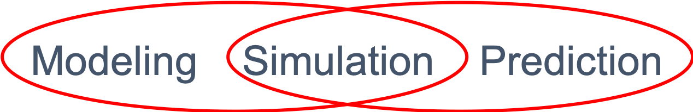

== Advancing Mod, Sim, Predict Convergence
//write text in as many clauses as necessary. Use one document or many, your choice!

Increasing computational power allows us to anticipate great advances based on convergence and interoperability existing capabilities in the areas of:

* Modeling and Simulation, e.g., training simulators
* Integrated environmental models, e.g., predictive geophysical computer models.
* Geo-Social modeling at several scales

OGC can bring a unique perspective and coordination to the convergent worlds of Modeling, Simulation, Prediction (MSP).  In particular OGC activity can:

* Identify the value of interoperability of geospatial MSP to making decisions
* Define concepts and semantic models that aid analysts in using MSP
    * Static and dynamic, empirical and analytic, etc.
* Interoperability methods for MSP models based on geospatial concepts, e.g., CRSs.
* Quality assessment: Effectiveness, Provenance, and Reproducibility

Cross cutting concepts

* CRS
* Time
* Geographic domains - layers, etc
* Integrative perspective
* workflow, processes, execution, WPS
* Geoscience Algorithm Integration Based on OWS Specifications:

The OGC Technology Forecasting has identified Mod, Sim, Predict as priority trend for assessment.  This note builds on previous OGC Future Directions sessions held at OGC Technical Committee meetings.  The following Figure was developed by Gobe Hobona for a Future Directions session.

//  If you want to reference a figure by using a figure number, it is important to use the following syntax. The figure identifier for <<img_mindMap>> is the first statement of the header. Please adapt the width as appropriate.

[#img_mindMap,reftext='{figure-caption} {counter:figure-num}']
.The overlapping technologies of Modeling, Simulation and Prediction

This Tech Note uses a set of related but distinct concepts.  Each of these concepts are based on using computer algorithms, simulations, processes to model some elements of our world.  They differ in the processes which the model and the purposes for which they are applied.

1. "Modeling and Simulation" provides synthetic environments of activities at a high level of realism; from simulation of theaters of war to factories and manufacturing processes; and, with an emphasis on visualization of and immersion into the environment being simulated.
2. "Simulation and Prediction" provides realistic estimates of a domain of analysis.  The objective is to provide estimates of variables of interest over a timeseries and in geographic context. Prediction methods may be based on theoretical models of the underlying phenomena or may be based on data science methods of statistics, probability or data mining.
3. Predictive modeling - statistical processes for spatially analyzing events in order to make statements of likelihood for event occurrence
4. Integrated Environmental Modeling  -
5. Built Environment Modeling

The US National Strategic Computing Initiative noted the need to address both Data Analytic Computing along with Modeling and Simulation:
Historically, there has been a separation between data analytic computing and modeling and simulation. Data analytics focuses on inferring new information from what is already known to enable action on that information. Modeling and simulation focuses on insights into the interaction of the parts of a system, and the system as a whole, to advance understanding in science and engineering and inform policy and economic decision-making. While these systems have traditionally relied on different hardware and software stacks, many of the current challenges facing the two disciplines are similar. A coherent platform for modeling, simulation, and data analytics would benefit both disciplines while maximizing returns on R&D investments18.

This Tech note is organized using the outline of Technology Roadmapping techniques that show the interrelation of Markets, Appplications and Technology across the several time horizons.

* Markets (Section 2)
* Applications (Section 3)
* Technology (Section 4)

With a particular emphasis on the steps needed to meeting the particular perspective that OGC can bring to advancing this trend (Section 5) .
