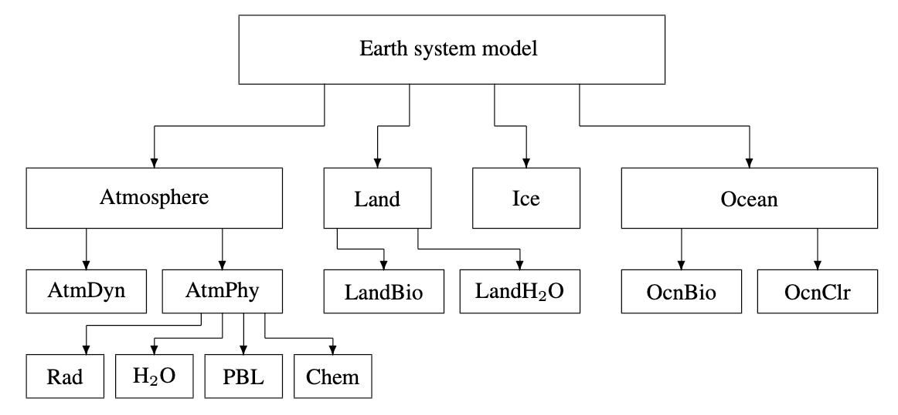

== Use cases for MSP  - Applications
//write text in as many clauses as necessary. Use one document or many, your choice!

1. Earth System Modeling
  1. Integrated environmental models
2. Modeling and Simulation
  1. Theatre scale models
3. Urban 3D modeling
  1. Digital Twin - Dynamic and Static
2. Gaming

Use Cases in the Spatial Modeling category include:

=== Earth System Modeling

[#img_mindMap,reftext='{figure-caption} {counter:figure-num}']
.Notional Architecture of Earth System Model

Balaji, V., Benson, R., Wyman, B., and Held, I.: Coarse-grained component concurrency in Earth system modeling: parallelizing atmospheric radiative transfer in the GFDL AM3 model using the Flexible Modeling System coupling framework, Geosci. Model Dev., 9, 3605-3616, https://doi.org/10.5194/gmd-9-3605-2016, 2016.

Climate, ecosystems, and planetary futures: The challenge to predict life in Earth system models
Gordon B. Bonan and Scott C. Doney
Many global change stresses on terrestrial and marine ecosystems affect not only ecosystem services that are essential to humankind, but also the trajectory of future climate by altering energy and mass exchanges with the atmosphere. Earth system models, which simulate terrestrial and marine ecosystems and biogeochemical cycles, offer a common framework for ecological research related to climate processes; analyses of vulnerability, impacts, and adaptation; and climate change mitigation. They provide an opportunity to move beyond physical descriptors of atmospheric and oceanic states to societally relevant quantities such as wildfire risk, habitat loss, water availability, and crop, fishery, and timber yields. To achieve this, the science of climate prediction must be extended to a more multifaceted Earth system prediction that includes the biosphere and its resources.
Bonan et al., Science 359, eaam8328 (2018) 2 February 2018

=== Integrated environmental models

• Description: Integrated environmental modeling provides a science-based structure to develop and organize relevant knowledge and information and apply it to explain, explore, and predict the behavior of environmental systems in response to human and natural sources of stress.
• Standards: OpenMI
• References: Environmental model access and interoperability: The GEO Model Web initiative

----
Integrated environmental modeling (IEM)is inspired by modern environmental problems, decisions, and policies and enabled by transdisciplinary science and computer capabilities that allow the environment to be considered in a holistic way. The problems are characterized by the extent of the environmental system involved, dynamic and interdependent nature of stressors and their impacts, diversity of stakeholders, and integration of social, economic, and environmental considerations. IEM provides a science-based structure to develop and organize relevant knowledge and information and apply it to explain, explore, and predict the behavior of environmental systems in response to human and natural sources of stress.
IEM is presented as a landscape containing four interdependent elements: applications, science, technology, and community. The elements are described from the perspective of their role in the landscape, current practices, and challenges that must be addressed.
----
From: Gerard F. Laniak, Gabriel Olchin, Jonathan Goodall, Alexey Voinov, Mary Hill, Pierre Glynn, Gene Whelan, Gary Geller, Nigel Quinn, Michiel Blind, Scott Peckham, Sim Reaney, Noha Gaber, Robert Kennedy, Andrew Hughes,
Integrated environmental modeling: A vision and roadmap for the future,
Environmental Modelling & Software, Volume 39, 2013, Pages 3-23, ISSN 1364-8152, https://doi.org/10.1016/j.envsoft.2012.09.006.

Integrated environmental modelling: achieving the vision
R. V. MOORE1 & A. G. HUGHES2*
Abstract: Integrated environmental modelling (IEM) is a recent phenomenon that offers the opportunity to solve complex environmental problems. Whilst it has made great strides in recent years, there are still challenges to be met before IEM is universally accepted and used. This paper describes the current state of IEM and sets out a roadmap for achieving its full potential. A multidisciplinary, multi-agency approach will be required, the main goals of which are to: (1) raise awareness and build confidence in IEM; (2) ensure availability and accessibility of IEM techniques, tools and standards; (3) establish a minimum set of standards; (4) build the IEM skills base; (5) establish an underpinning research and development (R&D) programme; (6) co-ordinate and promote collaboration; and (7) foster IEM use by government, industry and the public. Once these goals have been achieved, then IEM can be deployed to help resolve currently intractable environmental issues, and the IEM methodology can be transferred to other fields.
https://sp.lyellcollection.org/content/408/1/17

From integration to fusion: the challenges ahead
J. SUTHERLAND*, I. H. TOWNEND, Q. K. HARPHAM & G. R. PEARCE
Abstract:  The increasing complexity of numerical modelling systems in environmental sciences
has led to the development of different supporting architectures. Integrated environmental model-
ling can be undertaken by building a ‘super model’ simulating many processes or by using a generic
coupling framework to dynamically link distinct separate models during run-time. The application
of systemic knowledge management to integrated environmental modelling indicates that we are at
the onset of the norming stage, where gains will be made from consolidation in the range of stan-
dards and approaches that have proliferated in recent years. Consolidation is proposed in six topics:
metadata for data and models; supporting information; Software-as-a-service; linking (or interface)
technologies; diagnostic or reasoning tools; and the portrayal and understanding of integrated mod-
elling. Consolidation in these topics will develop model fusion: the ability to link models, with easy
access to information about the models, interface standards such as OpenMI and software tools to
make integration easier. For this to happen, an open software architecture will be crucial, the use of
open source software is likely to increase and a community must develop that values openness and
the sharing of models and data as much as its publications and citation records.
https://sp.lyellcollection.org/content/408/1/35

=== Modeling and simulation

• Description: Modeling and simulation applications support applications in which inter-connected simulators share a common view of the simulated environment.
• Standards: OGC CDB
• References:

1.     1. Mod/SIM/Predictions and VATC
    2. VATC 3D model generation
    3. Presagis to Launch Worldwide Terrain Viewer Based on Unreal Engine

==== M&S Terminology

From the United States Depart of Defense in the Modeling and Simulation Glossary:
* Live - A simulation involving real people operating real systems. Military training events using real equipment are live simulations. They are considered simulations because they are not conducted against a live enemy.
* Virtual - A simulation involving real people operating simulated systems. Virtual simulations inject a Human-in-the-Loop into a central role by exercising motor control skills (e.g., flying jet or tank simulator), decision making skills (e.g., committing fire control resources to action), or communication skills (e.g., as members of a C4I team).
* Constructive - A simulation involving simulated people operating simulated systems. Real people stimulate (make inputs to) such simulations, but are not involved in determining the outcomes. A constructive simulation is a computer program. For example, a military user may input data instructing a unit to move and to engage an enemy target. The constructive simulation determines the speed of movement, the effect of the engagement with the enemy and any battle damage that may occur. These terms should not be confused with specific constructive models such as Computer Generated Forces (CGF), a generic term used to refer to computer representations of forces in simulations that attempts to model human behavior. CGF is just one example model being used in a constructive environment. There are many types of constructive models that involve simulated people operating simulated systems.

Department of Defense  Modeling and Simulation (M&S)Glossary, October 1, 2011
http://www.acqnotes.com/Attachments/DoD%20M&S%20Glossary%201%20Oct%2011.pdf

==== Advancing M&S

1. Automated correlation - “correlation” is the industry term for sourcing, adjusting, and building the models. At the moment, a pile of shapefiles come in, lots of new stuff is generated, and someone manually adjusts feature data to align.  Many are working to build mod/sim-ready databases and some of the government CDB shops are finally reaching into automation.

2. Consumer-grade hardware/software use - the very expensive and very custom hardware required to run simulations is rapidly being replaced by hardware any of us can buy from Dell. Some of this comes from the continued growth in capability of the hardware, some comes from use of game engines. Both factors are converging, hence the OGC Interoperable Simulation and Gaming DWG.

=== Urban 3D modeling

• Description: A 3D city model is a representation of an urban environment with a three-dimensional geometry of common urban objects and structures, with buildings as the most prominent feature. 3D city models have become valuable for purposes beyond visualisation, and are utilised in a large number of domains and applications.
• Standards: CityGML
• References: Applications of 3D City Models: State of the Art Review

=== Gaming

OGC Interoperable Simulation and Gaming DWG.

* Unreal https://www.unrealengine.com
* Unity https://unity3d.com/
* Amazon Lumberyard https://aws.amazon.com/lumberyard/
* Open Source: Banshee 3D, Godot, Blender, jMonkey3
* Improbable SpatialOS https://improbable.io/games
